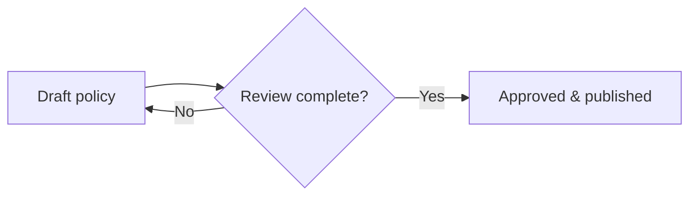

# Mermaid Support Implementation Plan

> **For agentic workers:** REQUIRED SUB-SKILL: Use $executing-plans to implement this plan task-by-task. Steps use checkbox (`- [ ]`) syntax for tracking.

**Goal:** Render fenced Mermaid blocks as secure, responsive diagrams in ISMS read and review views while keeping their Markdown source editable and lossless in TipTap.

**Architecture:** The canonical Marked renderer emits inert Mermaid placeholders. A globally registered Vue directive lazily loads Mermaid, renders placeholders after DOM updates, sanitizes returned SVG, and isolates failures per diagram. The existing editor conversion keeps Mermaid as a fenced code block and adds Mermaid to the code-language selector.

**Tech Stack:** Vue 3, Marked 17, DOMPurify 3, Mermaid 11.16.1, TipTap 3, Node test runner, jsdom 29, Vite 8

## Global Constraints

- Mermaid renders only in read-only display surfaces; TipTap keeps editable source.
- Mermaid uses `securityLevel: "strict"` and `startOnLoad: false`.
- Invalid syntax must not break the containing document.
- Non-Mermaid code blocks keep highlighting, line numbers, wrapping, and copy behavior.
- No change is committed.
- Screenshots are shown before any later decision about committing or publishing.

---

### Task 1: Emit inert Mermaid placeholders from the display renderer

**Files:**
- Modify: `web/package.json`
- Modify: `web/package-lock.json`
- Modify: `web/src/composables/useRenderMd.js`
- Create: `web/test/useRenderMd.test.js`

**Interfaces:**
- Consumes: Marked code-renderer tokens with `text` and `lang`.
- Produces: `.mermaid-diagram[data-mermaid-pending="true"]` elements whose `textContent` is the original source.

- [x] **Step 1: Install the Mermaid runtime and add the Node test command**

Run:

```bash
cd web
npm install mermaid@11.16.1
npm pkg set scripts.test="node --test"
```

Expected: `package.json` and `package-lock.json` contain Mermaid 11.16.1, and `npm test` invokes Node's built-in test runner.

- [x] **Step 2: Write failing display-renderer tests**

Create `web/test/useRenderMd.test.js`:

```js
import test from 'node:test'
import assert from 'node:assert/strict'
import { parseMd } from '../src/composables/useRenderMd.js'

test('Mermaid fences become inert diagram placeholders', () => {
  const html = parseMd('```mermaid\nflowchart LR\n  A --> B\n```')
  assert.match(html, /class="mermaid-diagram"/)
  assert.match(html, /data-mermaid-pending="true"/)
  assert.match(html, /flowchart LR\n  A --&gt; B/)
  assert.doesNotMatch(html, /copy-code-btn/)
})

test('Mermaid info strings are case-insensitive and may contain options', () => {
  const html = parseMd('```Mermaid wrap\ngraph TD\n  A --> B\n```')
  assert.match(html, /class="mermaid-diagram"/)
})

test('ordinary code fences retain the existing code presentation', () => {
  const html = parseMd('```js\nconst answer = 42\n```')
  assert.match(html, /class="code-block"/)
  assert.match(html, /copy-code-btn/)
  assert.match(html, /language-js/)
})
```

- [x] **Step 3: Run the focused test and observe the Mermaid assertion fail**

Run: `cd web && node --test test/useRenderMd.test.js`

Expected: the two Mermaid tests fail because Mermaid currently uses the ordinary code-block renderer; the JavaScript test passes.

- [x] **Step 4: Add the Mermaid branch to the canonical renderer**

In `web/src/composables/useRenderMd.js`, parse the info string before ordinary code handling and return escaped source:

```js
const info = (token.lang || '').trim().split(/\s+/).filter(Boolean)
const lang = info[0] || ''

if (lang.toLowerCase() === 'mermaid') {
  return (
    '<div class="mermaid-diagram" data-mermaid-pending="true">' +
    escapeHtml(token.text || '') +
    '</div>'
  )
}
```

Reuse `info` and `lang` in the existing code-block path so normal code behavior is unchanged.

- [x] **Step 5: Run the focused test**

Run: `cd web && node --test test/useRenderMd.test.js`

Expected: 3 tests pass and 0 fail.

---

### Task 2: Render placeholders securely through a Vue directive

**Files:**
- Create: `web/src/composables/useMermaid.js`
- Create: `web/src/directives/mermaid.js`
- Create: `web/test/useMermaid.test.js`
- Modify: `web/src/main.js`
- Modify: `web/src/style.css`

**Interfaces:**
- Consumes: a root `Element` containing `.mermaid-diagram[data-mermaid-pending="true"]` descendants.
- Produces: `renderMermaidDiagrams(root, loadRenderer?) => Promise<void>` and a Vue directive with `mounted` and `updated` hooks.

- [x] **Step 1: Write failing rendering tests**

Create `web/test/useMermaid.test.js` with jsdom installed before dynamically importing the browser module. Use a fake loader returning `{ render(id, source) }` and assert:

```js
test('renders every pending diagram with a unique id and sanitized SVG', async () => {
  const root = document.createElement('div')
  root.innerHTML = '<div class="mermaid-diagram" data-mermaid-pending="true">graph TD\nA--&gt;B</div><div class="mermaid-diagram" data-mermaid-pending="true">graph LR\nC--&gt;D</div>'
  const calls = []
  await renderMermaidDiagrams(root, async () => ({
    render: async (id, source) => {
      calls.push({ id, source })
      return { svg: `<svg><text>${source}</text><script>alert(1)</script></svg>` }
    },
  }))
  assert.equal(calls.length, 2)
  assert.notEqual(calls[0].id, calls[1].id)
  assert.equal(root.querySelectorAll('svg').length, 2)
  assert.equal(root.querySelectorAll('script').length, 0)
  assert.equal(root.querySelectorAll('[data-mermaid-state="rendered"]').length, 2)
})
```

Add a second test whose fake `render` rejects. Assert the target has `data-mermaid-state="error"`, `role="alert"`, and visible text `Diagram could not be rendered`. Add a third test that replaces `root.innerHTML` with a fresh pending placeholder and proves a second call renders the new source.

- [x] **Step 2: Run the rendering test and observe the missing-module failure**

Run: `cd web && node --test test/useMermaid.test.js`

Expected: FAIL because `src/composables/useMermaid.js` does not exist.

- [x] **Step 3: Implement lazy Mermaid loading and isolated rendering**

Create `web/src/composables/useMermaid.js` with:

```js
import DOMPurify from 'dompurify'

let sequence = 0
let rendererPromise

async function loadDefaultRenderer() {
  if (!rendererPromise) {
    rendererPromise = import('mermaid').then(({ default: mermaid }) => {
      mermaid.initialize({
        startOnLoad: false,
        securityLevel: 'strict',
        theme: 'dark',
        fontFamily: 'ui-sans-serif, system-ui, sans-serif',
        themeVariables: {
          background: '#020617',
          primaryColor: '#1e293b',
          primaryTextColor: '#e2e8f0',
          primaryBorderColor: '#475569',
          lineColor: '#64748b',
          secondaryColor: '#0f172a',
          tertiaryColor: '#172554',
        },
      })
      return mermaid
    })
  }
  return rendererPromise
}

function showError(target) {
  target.replaceChildren()
  target.dataset.mermaidState = 'error'
  target.setAttribute('role', 'alert')
  const message = document.createElement('span')
  message.className = 'mermaid-error-message'
  message.textContent = 'Diagram could not be rendered'
  target.append(message)
}

export async function renderMermaidDiagrams(root, loadRenderer = loadDefaultRenderer) {
  const targets = Array.from(root?.querySelectorAll?.('.mermaid-diagram[data-mermaid-pending="true"]') || [])
  if (targets.length === 0) return

  let renderer
  try {
    renderer = await loadRenderer()
  } catch {
    targets.forEach(showError)
    return
  }

  for (const target of targets) {
    const source = target.textContent || ''
    const id = `isms-mermaid-${++sequence}`
    target.removeAttribute('data-mermaid-pending')
    target.dataset.mermaidState = 'rendering'
    try {
      const { svg, bindFunctions } = await renderer.render(id, source)
      if (!root.contains(target)) continue
      target.innerHTML = DOMPurify.sanitize(svg, { USE_PROFILES: { svg: true, svgFilters: true } })
      target.dataset.mermaidState = 'rendered'
      bindFunctions?.(target)
    } catch {
      document.getElementById(id)?.remove()
      if (root.contains(target)) showError(target)
    }
  }
}
```

- [x] **Step 4: Implement and register the directive**

Create `web/src/directives/mermaid.js`:

```js
import { renderMermaidDiagrams } from '../composables/useMermaid.js'

function render(el) {
  void renderMermaidDiagrams(el)
}

export default { mounted: render, updated: render }
```

Update `web/src/main.js` to import the directive, create the app in a variable, register `.directive('mermaid', mermaidDirective)`, then use the router and mount.

- [x] **Step 5: Add diagram, loading, rendered-SVG, and error styles**

In `web/src/style.css`, add `.mermaid-diagram` styles using the existing slate palette: bordered rounded container, `overflow-x: auto`, centered content, minimum height during rendering, responsive `svg { display: block; max-width: 100%; height: auto; margin: auto; }`, and a rose-colored `.mermaid-error-message` state. Add print rules that remove the background and avoid breaking a diagram across pages.

- [x] **Step 6: Run rendering tests**

Run: `cd web && node --test test/useMermaid.test.js`

Expected: all rendering, error, sanitization, uniqueness, and rerender tests pass.

---

### Task 3: Wire all Markdown surfaces and preserve editor source

**Files:**
- Modify: `web/src/components/CodeBlockView.vue`
- Modify: `web/src/components/DocumentViewer.vue`
- Modify: `web/src/components/DocumentDiff.vue`
- Modify: `web/src/components/SideBySideReview.vue`
- Modify: `web/src/components/TrackChanges.vue`
- Modify: `web/src/views/Documents.vue`
- Modify: `web/src/views/Assets.vue`
- Modify: `web/src/views/Audit.vue`
- Modify: `web/src/views/Changes.vue`
- Modify: `web/src/views/CorrectiveActions.vue`
- Modify: `web/src/views/Incidents.vue`
- Modify: `web/src/views/Legal.vue`
- Modify: `web/src/views/Objectives.vue`
- Modify: `web/src/views/Programs.vue`
- Modify: `web/src/views/Risks.vue`
- Modify: `web/src/views/Suppliers.vue`
- Modify: `web/src/views/Systems.vue`
- Modify: `web/src/views/Tasks.vue`
- Create: `web/test/useMarkdownConvert.test.js`

**Interfaces:**
- Consumes: globally registered `v-mermaid`; `markdownToHtml(md)` and `htmlToMarkdown(html)`.
- Produces: rendered diagrams on all canonical Markdown display roots and an editor language option with id `mermaid`.

- [x] **Step 1: Write a failing editor round-trip test**

Create `web/test/useMarkdownConvert.test.js`. Initialize jsdom globals before dynamically importing `useMarkdownConvert.js`, then assert:

```js
const source = '```mermaid\nflowchart TD\n  Draft --> Review --> Approved\n```'
const html = markdownToHtml(source)
assert.match(html, /class="language-mermaid"/)
assert.equal(htmlToMarkdown(html).trim(), source)
```

Run: `cd web && node --test test/useMarkdownConvert.test.js`

Expected: the test exposes any current loss in the Mermaid fence round-trip; if it already passes, retain it as the regression test before UI wiring.

- [x] **Step 2: Add Mermaid to the editor code-language selector**

In `web/src/components/CodeBlockView.vue`, add `{ id: 'mermaid', label: 'Mermaid' }` to the sorted language list and adjust the comment so it states that Mermaid is intentionally retained as plain source rather than highlighted by lowlight.

- [x] **Step 3: Add the directive to document and review render roots**

Add `v-mermaid` to the Markdown `v-html` root in `DocumentViewer.vue`, the document block root in `Documents.vue`, the diff root in `DocumentDiff.vue`, both block roots in `SideBySideReview.vue`, and the Markdown block root in `TrackChanges.vue`. Do not add it to comment-body HTML.

- [x] **Step 4: Add the directive to register entity Markdown fields**

Add `v-mermaid` beside `v-html="renderMd(...)"` on every `.doc-prose` field in Assets, Audit, Changes, CorrectiveActions, Incidents, Legal, Objectives, Programs, Risks, Suppliers, Systems, and Tasks. Do not touch non-Markdown mention/comment renderers.

- [x] **Step 5: Run all web tests and the production build**

Run:

```bash
cd web
npm test
npm run build
```

Expected: every Node test passes; Vite exits 0 and produces `web/dist` without compile errors.

- [x] **Step 6: Verify the complete uncommitted diff**

Run:

```bash
git diff --check
git status --short
git diff --stat
```

Expected: no whitespace errors; only the Mermaid implementation, tests, dependency lockfile, design, and plan are modified or untracked; no commit exists.

---

### Task 4: Browser verification and screenshots

**Files:**
- No source files beyond any minimal fix required by a reproduced browser defect.
- Create user-facing screenshots under `/Users/sbstn/Documents/Codex/2026-08-13/kan/outputs/`.

**Interfaces:**
- Consumes: the locally running ISMS backend and Vite frontend with a sample document containing Mermaid Markdown.
- Produces: screenshots proving rendered view, editable source, and controlled invalid-syntax behavior.

- [x] **Step 1: Start the repository's documented local demo stack**

Use the existing demo/development instructions and seed data. Start PostgreSQL/backend and Vite without changing production configuration.

- [x] **Step 2: Create or edit a sample document with a flowchart**

Use this source:

````text

````

- [x] **Step 3: Capture the successful read and edit states**

Open the document read view and capture the rendered diagram. Enter edit mode and capture the same block as Mermaid source with the Mermaid language selected.

- [x] **Step 4: Verify and capture invalid syntax**

Temporarily use `flowchart ???` in the sample, open the read view, and confirm the inline `Diagram could not be rendered` state without page failure. Restore the valid example after the screenshot.

- [x] **Step 5: Re-run final verification**

Run `cd web && npm test && npm run build`, then `git diff --check` and `git status --short`.

Expected: tests and build pass, screenshots exist, valid sample is restored, and all repository changes remain uncommitted.
