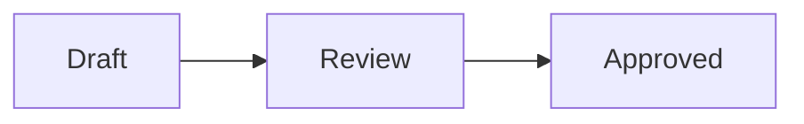

# Markdown rendering

ISMS stores document bodies and register free-text fields as Markdown. The web
application has two deliberately separate pipelines:

- **Display rendering** turns Markdown into sanitized HTML and renders Mermaid
  diagrams for read-only views.
- **Editor conversion** turns Markdown into TipTap HTML and back without
  executing diagrams or losing fenced-code metadata.

Keeping these pipelines separate prevents display-only markup such as copy
buttons and rendered SVG from leaking into stored Markdown.

## Mermaid syntax

The first fenced-code info token selects Mermaid, case-insensitively:

````markdown

````

Additional info tokens are retained through editor round-trips. Other fenced
code blocks continue to use syntax highlighting, line numbers, wrapping, and
the copy action.

## Display pipeline

`web/src/composables/useRenderMd.js` is the canonical Markdown display
renderer. A Mermaid fence becomes an inert placeholder containing escaped
source text:

```html
<div class="mermaid-diagram" data-mermaid-pending="true">...</div>
```

The complete read path is:

1. Marked parses Markdown.
2. The custom code renderer emits either a Mermaid placeholder or the existing
   highlighted code-block markup.
3. DOMPurify sanitizes the generated display HTML. Diff and review callers that
   require extra tags use `parseMd()` and apply their own DOMPurify boundary.
4. Vue inserts the sanitized HTML through `v-html`.
5. The globally registered `v-mermaid` directive scans that root for pending
   placeholders.
6. `web/src/composables/useMermaid.js` lazy-loads Mermaid, renders each diagram,
   sanitizes the returned SVG, and inserts it into its original placeholder.

The directive is attached to document, review, diff, track-changes, and
register-field Markdown roots. Comment and mention renderers are intentionally
excluded; they have their own constrained rendering path and do not execute
diagram source.

## Lifecycle

The directive runs on both Vue `mounted` and `updated`. Pending placeholders are
claimed synchronously before the Mermaid module is loaded. This prevents an
overlapping update from scheduling the same DOM node twice while the lazy import
is still pending.

Every render receives a unique `isms-mermaid-N` identifier. Diagrams within a
root are processed sequentially; Mermaid also serializes its internal render
queue because it uses temporary document-level elements. Before inserting an
asynchronous result, the renderer verifies that the target still belongs to the
original root; results for replaced content are discarded.

If content is replaced, its new placeholders carry
`data-mermaid-pending="true"` and the next directive update renders them.

## Security boundary

Diagram rendering is client-side only. No Mermaid-generated SVG is stored in
git or sent back to the server.

The boundary has four layers:

1. Markdown source enters the placeholder as escaped text, not executable HTML.
2. Mermaid is initialized with `startOnLoad: false`,
   `securityLevel: "strict"`, and `suppressErrorRendering: true`.
3. `htmlLabels: false` keeps labels as SVG text instead of `foreignObject` HTML.
4. The returned SVG passes through DOMPurify's `svg` and `svgFilters` profiles
   before insertion. Mermaid binding functions run only against that sanitized
   result.

The normal display-HTML DOMPurify pass remains in place before Mermaid runs, so
diagram support does not weaken the existing `v-html` boundary.

## Failure handling

A syntax or loading failure affects only its diagram. The placeholder becomes
an accessible `role="alert"` state with the message
`Diagram could not be rendered` and an inert preformatted copy of the source.
This keeps invalid or diff-marked diagrams inspectable without introducing a
new HTML sink; the source is assigned through `textContent`.

Mermaid error SVGs and temporary wrapper or sandbox elements are removed. The
original fenced source remains available in the editor for correction.

## Editor round-trip

`web/src/composables/useMarkdownConvert.js` converts between stored Markdown and
TipTap HTML. Mermaid stays a plain editable code block; the editor never loads
or executes Mermaid.

The surrounding `<pre>` carries two internal attributes:

- `data-info-string` retains the complete original fence info string.
- `data-wrapped` retains the editor's per-block wrapping choice.

`web/src/components/codeBlockAttributes.js` defines the corresponding TipTap
attributes shared by `DocumentEditor` and `MarkdownField`. When a user changes
the language or wrapping controls, only those tokens are updated; unrelated
info tokens remain intact. Mermaid trailing blank source lines are preserved.

## Styling and printing

Global styles in `web/src/style.css` provide the slate container, loading and
error states, horizontal overflow, and responsive SVG sizing. Mermaid uses its
configurable `base` theme so the slate palette reaches the generated SVG. Print
styles avoid splitting a diagram across pages, remove the application container
background, and invert the complete dark SVG palette to preserve text/shape
contrast on white paper.

## Adding a Markdown display surface

For a new field that uses the canonical free-text Markdown model:

1. Render it with `renderMarkdown()`, or use `parseMd()` followed by an explicit
   DOMPurify configuration when additional safe tags are required.
2. Put `v-mermaid` on the same element that owns the resulting `v-html`.
3. Do not add the directive to comment, mention, or other constrained rich-text
   renderers without first extending their security model.
4. Add a focused test when the surface has custom sanitization or update
   behavior.

## Test coverage

| File | What it covers |
|---|---|
| `web/test/useRenderMd.test.js` | Mermaid placeholder detection and unchanged ordinary code rendering |
| `web/test/useMermaid.test.js` | Safe configuration, real syntax errors, SVG sanitization, unique IDs, rerendering, and overlapping lifecycle calls |
| `web/test/mermaidDirective.test.js` | Vue mounted/updated directive hooks |
| `web/test/useMarkdownConvert.test.js` | Fence source, info-token, language, wrapping, and trailing-line round-trips |
| `web/test/codeBlockMetadata.test.js` | TipTap preservation of Mermaid metadata |
| `web/test/codeLanguages.test.js` | Mermaid availability in the editor language selector |
| `web/test/editorLowlight.test.js` | Plain Mermaid source without lowlight auto-detection |
| `web/test/mermaidPrintStyles.test.js` | Print palette inversion for text/shape contrast |
